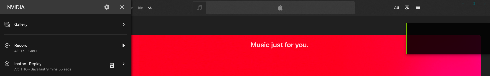

# Nvidia_Instant_Replay_Fix

**Stops NVIDIA Instant Replay (ShadowPlay) from cutting out when a "protected" app — a DRM browser tab, Apple Music, Netflix — is on screen. Set it once; it runs itself.**

## Demo

**Apple Music open and playing — yet Instant Replay stays on. NVIDIA never disables it:**




## Install

Download **`Nvidia_Instant_Replay_Fix.ps1`** from the **[latest release](../../releases/latest)**, then run it:

```powershell
powershell -ExecutionPolicy Bypass -File .\Nvidia_Instant_Replay_Fix.ps1
```

That one file does everything — it downloads the engine, installs a hidden background task, and starts protecting Instant Replay. **No admin needed.** Record/save with your usual NVIDIA hotkey (default **Alt+F10**).

To remove it later, run the same file and choose **Uninstall**.

## Antivirus / "Virus detected"

Your browser, SmartScreen, or antivirus **will probably flag the download** — that's expected, and it's a **false positive**. The tool injects a few bytes into NVIDIA's `nvcontainer.exe` (`OpenProcess` + `WriteProcessMemory`), the same API pattern malware uses, so heuristic scanners raise a generic `HackTool` / `CodeInjector` flag. There is no network exfiltration, no hidden payload, and the only persistence is a scheduled task you can see and remove.

Don't take my word for it — **verify**:

- **VirusTotal:** scan it yourself at [virustotal.com](https://www.virustotal.com/gui/home/upload) — drop in the exe, or paste the [release download URL](https://github.com/iALTURKi/Nvidia_Instant_Replay_Fix/releases/latest/download/Nvidia_Instant_Replay_Fix.exe). You'll see only a few heuristic engines, not a real signature. This build: `sha256 673de943…1ad4d598`.
- **Read the source** — single-file C, all in this repo.
- **Build it yourself** — `cd c && build.bat`; a binary *you* compiled isn't download-flagged.

If you've verified it and trust it, choose **Keep** in the browser warning, or add a Windows Security exclusion for `%LOCALAPPDATA%\Nvidia_Instant_Replay_Fix\`.

Why it fires (it's a `…!ml` machine-learning guess, not a signature) and how it's being cleared — Microsoft false-positive report + code signing — is written up in **[docs/ANTIVIRUS.md](docs/ANTIVIRUS.md)**.

Open-source, runs as you (no admin), no telemetry; the only network call is fetching the engine from this repo's releases.

## Credits & license

Based on the approach pioneered by **[furyzenblade/ShadowPlay_Patcher](https://github.com/furyzenblade/ShadowPlay_Patcher)**.

MIT © 2026 **[iALTURKi](https://github.com/iALTURKi)** — see [LICENSE](LICENSE). Independent, unofficial tool; not affiliated with NVIDIA Corporation.
